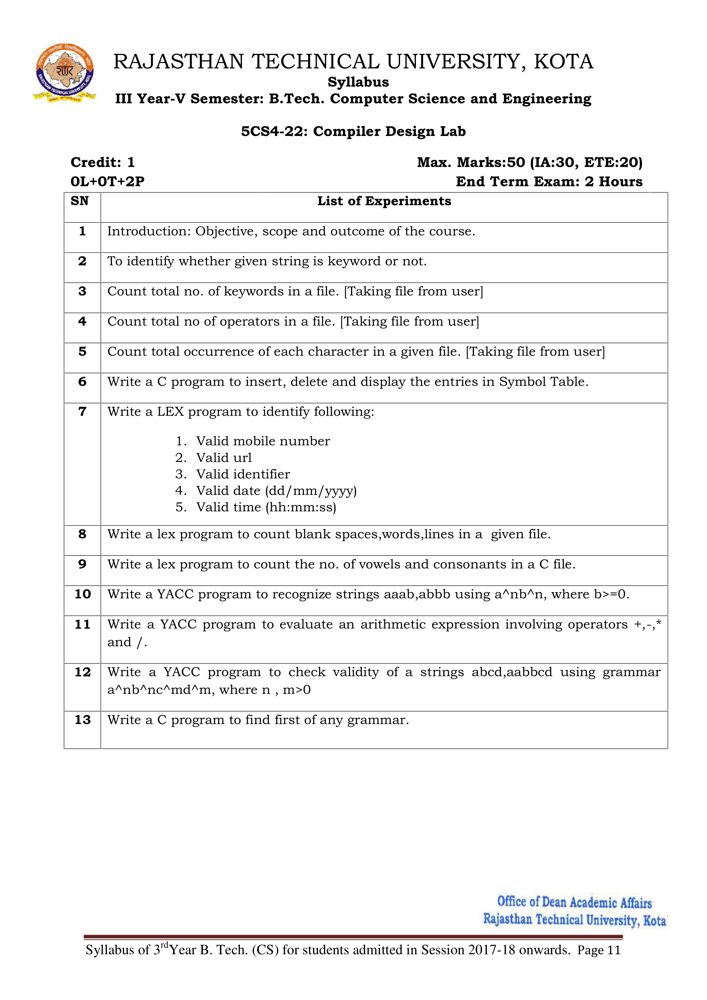

# Compiler-Design
College Lab Work

Compiler design covers basic translation mechanism and error detection & recovery. It includes lexical, syntax, and semantic analysis as front end, and code generation and optimization as back-end.

